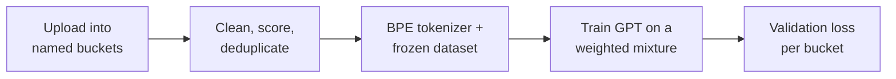

&nbsp;

 

## About

Computer Science student at Missouri State University with a Cybersecurity minor, graduating December 2026. I build AI systems and the software around them: LLM routing, small models trained from scratch, retrieval-grounded assistants, and the full-stack applications that put them in front of people. Everything below has an automated test suite and a README that says what is real and what is not. Open to software engineering, AI engineering, and forward deployed engineering roles.

 

## Projects

A self-hosted LLM gateway. Applications call one OpenAI-compatible endpoint with `model: auto`; the router estimates the task type and difficulty, filters models by capability and context window, ranks the rest on cost, latency, and task fit, and saves the decision alongside the completion: candidate scores, token usage, estimated cost, and whether a fallback was used. Without provider keys it runs in an offline mode with clearly labeled simulated completions, so routing can be inspected before anything is spent.

TypeScript · Fastify · React · SQLite · about 900 tests · CI on Linux and Windows

Details

 

- Built-in adapters for OpenAI, Anthropic, Gemini, OpenRouter, and Groq, plus any API that speaks OpenAI Chat Completions. Streaming over SSE and function tool calls are supported
- Provider keys are stored encrypted with AES-256-GCM. Each application gets its own router key, stored as a hash and revocable independently. A separate administrator key unlocks settings
- The completion and the saved routing decision share a request ID, so any request can be traced back to why that model was chosen
- CI runs lint, type checks, coverage gates (90% lines, 95% functions, 80% branches), a production smoke test, and an HTTP simulation with isolated router and provider servers, on Ubuntu and Windows. A Playwright check drives every page in both themes and fails on any text below its contrast floor

 

A local application for training small GPT-style models from scratch on controlled data mixtures and measuring what each data source contributed. Documents are uploaded into named buckets, cleaned and scored, tokenized into an immutable dataset with a held-out validation slice per bucket, and used to train a model whose validation loss is tracked per bucket. Every result traces back to hashed inputs, a seed, and a code revision. Started as a CSC 450 team project, where I owned the architecture, the ingestion pipeline, and the full-stack work, and has continued in a private repository since. Demo available on request.

Python · PyTorch · FastAPI · React · TypeScript · 740+ tests in the current version

Details

 

- Decoder-only Transformer and training loop written in PyTorch, with three presets from about 3M to 34M parameters. Training runs as a separate process the app starts and stops, and resumes from saved checkpoints
- Ingestion for text, Markdown, HTML, text-layer PDF, and JSONL: cleaning, quality statistics per document, duplicate rejection, BPE tokenizer training, and immutable dataset builds
- Evaluation per bucket: validation loss, perplexity, bits per byte, saved prompt sets, side-by-side run comparison, and a playground for sampling from checkpoints
- A memory estimate before each run, covering weights, optimizer state, gradients, and activations, so a configuration that will not fit the GPU is refused before it starts
- A `forge` command-line tool that drives the same local API the browser uses
- In progress: the same measurements for imported open-weight models, with continued pretraining, LoRA and QLoRA adapters, and model merging. Written and tested, but so far only against a synthetic model

 

A customer service platform for small businesses. Web chat, email, WhatsApp, Instagram, SMS, and phone calls arrive in one inbox as one customer record. The assistant drafts replies only from the company's own help articles, attaches the passages behind every answer, and hands the conversation to a person when retrieval comes up short. Tap AI listens to a live call and shows the agent the relevant policy and the next question while the customer is still speaking. It never speaks to the customer.

Python · FastAPI · React · TypeScript · SQLite or PostgreSQL · Docker · 276 tests

Details

 

- Customers are matched across channels by email and phone, so a WhatsApp conversation and a later email land on the same record
- Retrieval is BM25 by default with embeddings optional. Works with OpenAI, Anthropic, Gemini, anything that speaks the OpenAI protocol such as Ollama, or no model at all, in which case it still answers from retrieval
- Web chat works out of the box through a 4.5 kB gzipped embeddable widget with no dependencies. Email, WhatsApp, Instagram, SMS, and voice have adapters, signature checks, and webhooks built and need provider credentials to run
- Roles are enforced on the server: agents draft help articles, supervisors publish them, and only published articles can be quoted. Ticketing includes SLA clocks, routing rules, and saved replies
- One schema on SQLite and PostgreSQL. CI runs the backend suite against both, then builds the Docker image and checks that the container starts, serves, and does not run as root

 

Scanner-first intake, grading, and reporting for wholesale phone lots. Scanning an IMEI identifies the device; number keys grade it, letter keys flag defects, and `Enter` saves it and readies the next scan, so the operator's hands stay on the scanner. It is a portfolio build of a real workflow: the data store is in memory and sign-in is a stub, while the keyboard flow, IMEI validation, completion rules, and Excel export are complete.

TypeScript · React · Node.js · Express · 73 tests

Details

 

- The Luhn check digit is verified as the IMEI is typed; brand, model, storage, and colour are decoded from the TAC; WiFi tablet serials are told apart from IMEIs automatically
- Two rules are enforced in the API, not only the interface: a device is not finished without photo evidence, and an order is not finished until every expected device is signed off
- The Excel writer is about 450 lines of TypeScript with no dependency beyond Node's `zlib`, and produces a styled workbook per order with a summary sheet, grade and defect breakdowns, and every device row
- Grades, defects, IMEI validation, and request schemas live in one shared module used by the client, the API validator, and the spreadsheet

 

A paper-trading research harness for a small set of uranium and gold equities. Two LLM analysts and a rule-based baseline trade separate virtual wallets from the same data and the same risk engine, so every model decision has a control to compare against. The model only proposes; deterministic code sizes the position, checks the kill switch, and places the order, and every decision is journaled with its inputs, prompt version, raw model output, and risk verdict. The first version was built end to end in July and run manually against real market data; an audit then found 38 issues with running it unattended, and the core is being rebuilt. It has not paper traded yet, and no real money is involved. Private until it is.

Python · PostgreSQL with pgvector · Next.js · about 900 tests

 

## Tools

 

Also: Transformers written from scratch, Hugging Face, LoRA and QLoRA, BM25 and embedding retrieval, the OpenAI, Anthropic, and Gemini APIs, Ollama, Pytest, Vitest, Playwright.

 

Questions about any of this: <a href="https://www.linkedin.com/in/salim-ba-mehriz-959139276/">LinkedIn</a> or <a href="mailto:BamehrizSalim@gmail.com">email</a>.

